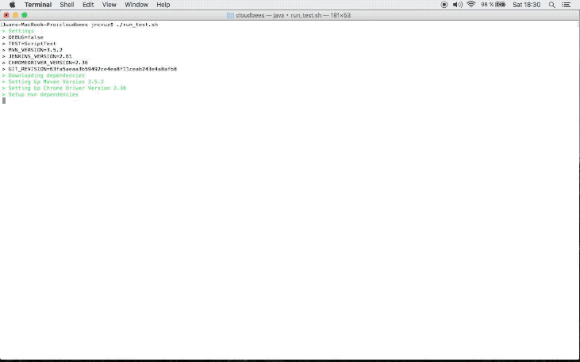

## CloudBees Test Runner (CBRT)

### WHAT IT IS:

This is the solution to take-home exercise **Part I**.

Solution to Part II can be found on a separated file.

This is a simple script that automates the setup of acceptance test harness (ATH) in order to run tests with a specifc jenkins version. 

### REQUIREMENTS:

CBRT requires:
* Mac-OSx
* Java
* Curl
* Chrome

#### WHY?
* Script was developed using my personal Mac laptop.
* Java, Chrome and Curl require admin priviledges to be installed.
* I chose Chrome as it is one of most used and spread web explorers.
* Rest of dependecies like maven, chromedriver, jenkins war and ATH code are fetched using  curl.

### HOW TO USE IT:
1. FIRST,  clone the sources.
2. SECOND, Run ```./run_test.sh ``` and it will setup everything:
	* Download dependecies
	* Setup dependecies 
	* Run test
	* Generate test report
3. THIRD, Run ```./run_test.sh -h``` to get some help about usage.

### OBSERVATIONS:
* Specific ATH revision is checked-out as it is known to be compatible with Jenkins 2.61.
* CBTR offers the possibility of running test using different versions of Jenkins, Maven and Chrome driver.
* First time running would take longer as needs to setup everything. Consecutives runs would be faster as eveything is already setup.

### EXAMPLES OF USAGE:

``` bash
Juans-MacBook-Pro:cloudbees jmcruz$ ./run_test.sh -h
Usage: run_test.sh options (-c chromedriver_version) (-m mvn_version) (-j jenkins_version) (-t test_name) (-d) (-u) (-h)
-c chromedriver_version  :  specify chrome driver version (default 2.36)
-m mvn_version           :  specify mvn version (default 3.5.2)
-j jenkins_version       :  specify jenkins version (default 2.61)
-t test_name             :  specify test to run (default ScriptTest)
-d                       :  enable verbose output
-u                       :  clean-up before testing
-h                       :  show this help
```
